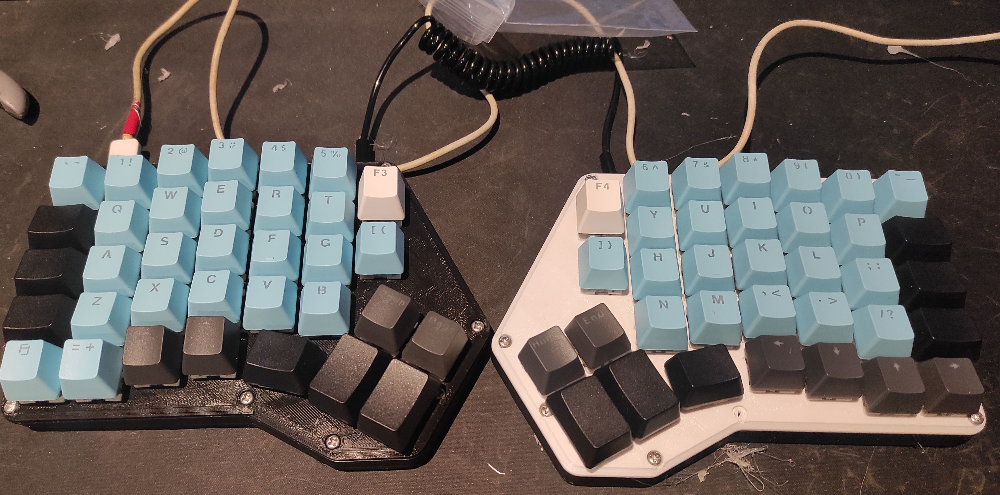

<h3 align="center">Redox keyboard</h3>
<h5 align="center">aenrione</h5>

---

The Redox project is an open-source, [QMK (Quantum Mechanical Keyboard Firmware)](https://github.com/qmk/qmk_firmware) powered, ergonomic split mechanical keyboard. [The Official repository](http://) has information about the project and instruction on how to use and assemble the Redox keyboard. This repository has the firmware I use and all the modifications I make throughout the way.

<h5 align="center">My first build</h5>
